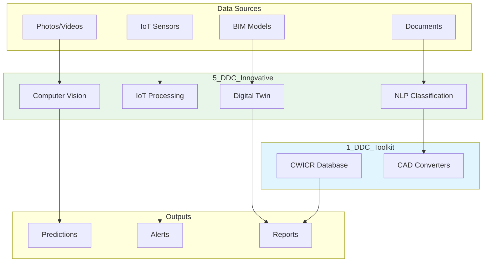

# DDC_Innovative

**Advanced AI/ML skills for next-generation construction automation.**

These skills represent cutting-edge applications of artificial intelligence, machine learning, computer vision, and IoT in construction.

## Overview

| Category | Skills | Focus |
|----------|--------|-------|
| AI/ML Analytics | 7 | Predictive models, risk assessment, NLP |
| Computer Vision | 3 | Defect detection, progress monitoring, site surveys |
| IoT & Sensors | 2 | Material tracking, environmental monitoring |
| Advanced BIM | 4 | Digital twins, clash detection, automation |
| Process Optimization | 6 | Logistics, labor, permits, change orders |

**Total: 22 skills**

## Skill Categories

### AI/ML Analytics

| Skill | Description |
|-------|-------------|
| [risk-assessment-ml](risk-assessment-ml/) | ML-based project risk prediction and mitigation |
| [document-classification-nlp](document-classification-nlp/) | NLP for automatic document categorization |
| [contractor-matching-ai](contractor-matching-ai/) | AI-powered contractor selection and matching |
| [weather-impact-analysis](weather-impact-analysis/) | Predictive weather impact on schedules |
| [change-order-analysis](change-order-analysis/) | Pattern analysis for change order prediction |
| [labor-productivity-analytics](labor-productivity-analytics/) | Workforce productivity optimization |
| [energy-simulation](energy-simulation/) | Building energy performance modeling |

### Computer Vision

| Skill | Description |
|-------|-------------|
| [defect-detection-ai](defect-detection-ai/) | Automated defect identification from images |
| [progress-monitoring-cv](progress-monitoring-cv/) | Visual progress tracking using photos |
| [drone-site-survey](drone-site-survey/) | Drone imagery analysis for site surveys |

### IoT & Sensors

| Skill | Description |
|-------|-------------|
| [material-tracking-iot](material-tracking-iot/) | Real-time material location and inventory |
| [safety-compliance-checker](safety-compliance-checker/) | IoT-based safety monitoring |

### Advanced BIM

| Skill | Description |
|-------|-------------|
| [digital-twin-sync](digital-twin-sync/) | Real-time BIM synchronization |
| [clash-detection-analysis](clash-detection-analysis/) | Automated clash detection and resolution |
| [ifc-data-extraction](ifc-data-extraction/) | Advanced IFC model data extraction |
| [revit-dynamo-automation](revit-dynamo-automation/) | Revit automation with Dynamo scripts |

### Process Optimization

| Skill | Description |
|-------|-------------|
| [site-logistics-optimization](site-logistics-optimization/) | Optimal site layout and logistics |
| [prefab-optimization](prefab-optimization/) | Prefabrication planning and optimization |
| [permit-tracking-automation](permit-tracking-automation/) | Automated permit workflow management |
| [as-built-documentation](as-built-documentation/) | Automated as-built documentation |
| [n8n-workflow-automation](n8n-workflow-automation/) | Advanced n8n workflow patterns |
| [open-construction-estimate](open-construction-estimate/) | Open-source estimation platform |

## Technology Stack

```
┌─────────────────────────────────────────────────────────────┐
│                    5_DDC_Innovative                         │
├─────────────────────────────────────────────────────────────┤
│  AI/ML                │  Computer Vision  │  IoT           │
│  - TensorFlow         │  - OpenCV         │  - MQTT        │
│  - PyTorch            │  - YOLO           │  - LoRaWAN     │
│  - scikit-learn       │  - Segment AI     │  - Bluetooth   │
│  - Transformers       │  - DroneDeploy    │  - RFID        │
├─────────────────────────────────────────────────────────────┤
│  BIM Integration      │  Cloud Services   │  APIs          │
│  - ifcopenshell       │  - AWS/GCP/Azure  │  - REST        │
│  - Dynamo             │  - Edge Computing │  - GraphQL     │
│  - Revit API          │  - Docker/K8s     │  - WebSocket   │
└─────────────────────────────────────────────────────────────┘
```

## Integration with DDC Ecosystem



## Use Cases

### Predictive Maintenance
```
Material sensors → IoT data → ML model → Maintenance alerts
```

### Automated Quality Control
```
Site photos → Defect detection → Issue tracking → Reports
```

### Real-time Progress Tracking
```
Drone surveys → CV analysis → Digital twin update → Dashboard
```

### Risk Management
```
Historical data → ML risk model → Risk score → Mitigation plan
```

## Requirements

Most skills require:
- Python 3.9+
- GPU recommended for CV/ML skills
- Cloud account for some services
- Specific SDKs (see individual skills)

## Getting Started

1. **Start simple**: Begin with `document-classification-nlp` or `weather-impact-analysis`
2. **Add CV**: Progress to `progress-monitoring-cv` for visual tracking
3. **Scale with IoT**: Implement `material-tracking-iot` for real-time data
4. **Full integration**: Deploy `digital-twin-sync` for comprehensive BIM sync

## Roadmap

- [ ] GPT-4 Vision integration for site analysis
- [ ] Edge AI deployment for real-time processing
- [ ] AR/VR integration for field visualization
- [ ] Federated learning for privacy-preserving ML

## License

MIT License - See individual skills for specific dependencies.
