# DDC Skills Collection for AI Coding Assistants

**AI Tools for Construction Company Automation**

### Works with any AI coding assistant:
`Claude Code` · `Cursor` · `GitHub Copilot` · `Gemini Code Assist` · `Cody` · `Continue` · `OpenCode` · `Aider`

---

## What is this?

A collection of **221 skills** for automating construction company processes with AI coding assistants.

### What is a "Skill"?

A skill is a `SKILL.md` file — structured instructions that an AI coding assistant can read and execute. Each skill describes a specific task: what problem it solves, what code to generate, and what tools are needed. You open a skill folder in your AI assistant, and it helps you implement the described functionality.

---

## Where to Start

### If you manage or lead a construction company:

**Step 1.** Read [GETTING_STARTED.md](GETTING_STARTED.md) — a non-technical overview of what can be automated and how to prioritize.

**Step 2.** Download the [Data-Driven Construction](Books/) book (free, 31 languages) — it explains the methodology behind these skills: how to assess your company's data maturity, identify bottlenecks, and plan digital transformation.

**Step 3.** Identify your biggest pain point in the table below and start with the corresponding skill.

### If you are a developer or IT lead:

**Step 1.** Install prerequisites (see [Prerequisites](#prerequisites)).

**Step 2.** Pick a skill from the table below, open its folder in your AI assistant, and follow the `SKILL.md`.

**Step 3.** Adapt the generated code to your data and deploy.

---

## What Can You Automate?

Pick your problem — get the skill to solve it:

| Your problem | What the skill does | Skill to run | Folder |
|--------------|---------------------|--------------|--------|
| Searching for work item rates takes too long | Semantic search across 55,719 items in 31 languages | `semantic-search-cwicr` | `1_DDC_Toolkit/` |
| Estimators spend days building estimates manually | Generates estimates from historical data and templates | `estimate-builder` | `1_DDC_Toolkit/` |
| BIM models contain data but it's locked in Revit/IFC | Extracts quantities and properties to Excel | `ifc-to-excel`, `revit-to-excel` | `1_DDC_Toolkit/` |
| Daily/weekly reports take hours to compile | Automated data collection and report generation | `n8n-daily-report` | `3_DDC_Insights/` |
| Site photos pile up with no organization | AI classifies and tags site photos automatically | `n8n-photo-report` | `3_DDC_Insights/` |
| Data is scattered across Excel files, emails, PDFs | Finds all data sources and maps dependencies | `data-silo-detection` | `2_DDC_Book/` |
| No visibility into project KPIs | Dashboard with real-time metrics from your data | `kpi-dashboard` | `1_DDC_Toolkit/` |
| Budget overruns discovered too late | Scheduled budget vs. actual comparison | `budget-tracker` | `1_DDC_Toolkit/` |
| PDF specifications need to be searchable | Extracts text and tables from PDFs into structured data | `specification-extractor` | `2_DDC_Book/` |
| Schedule delays are hard to predict | Statistical analysis of schedule variance patterns | `schedule-delay-analyzer` | `3_DDC_Insights/` |

---

## Collection Structure

Skills are organized by source and complexity level:

| Category | What's inside | Skills | Start here if... |
|----------|---------------|--------|------------------|
| **1_DDC_Toolkit** | Production-ready tools: CWICR database, CAD converters, analytics | 85 | You need a working tool now |
| **2_DDC_Book** | Skills mapped to book chapters: data evolution, types, estimation, ML | 67 | You want to follow a structured learning path |
| **3_DDC_Insights** | Practical workflows: n8n automation, AI agents, field tools | 20 | You need workflow automation |
| **4_DDC_Curated** | Document generation (PDF, Excel, DOCX, PPTX), quality checks | 20 | You need document or report templates |
| **5_DDC_Innovative** | Advanced: computer vision, IoT, digital twins, risk assessment | 29 | You're ready for AI/ML experimentation |

```mermaid
mindmap
  root((DDC Skills<br/>221 skills))
    1_DDC_Toolkit
      CWICR Database
        55,719 work items
        31 languages
      CAD Converters
        Revit → Excel
        IFC → Excel
        DWG → Excel
      Analytics
        KPI Dashboard
        Cost Analysis
    2_DDC_Book
      Part I: Data Evolution
      Part II: Data Types
      Part III: Estimation
      Part IV: Analytics & ML
      Part V: Threats & Strategy
    3_DDC_Insights
      n8n Workflows
        Daily Reports
        Photo Reports
      AI Agents 2026
      Field Automation
    4_DDC_Curated
      Document Generation
        PDF, Excel
        DOCX, PPTX
      Quality Assurance
    5_DDC_Innovative
      AI/ML Skills
        Defect Detection
        Risk Assessment
      IoT & Sensors
      Advanced BIM
        Digital Twin
```



---

## How to Use a Skill

```
1. Clone this repository
   git clone https://github.com/datadrivenconstruction/DDC_Skills_for_AI_Agents_in_Construction.git

2. Open a skill folder in your AI assistant
   cd DDC_Skills_for_AI_Agents_in_Construction/1_DDC_Toolkit/CWICR-Database/semantic-search-cwicr/

3. The assistant reads SKILL.md and generates the code for you

4. Review, adapt to your data, and run
```

### Example: ETL Pipeline

```python
# Automatic processing of all Excel files from a folder

import pandas as pd
from pathlib import Path

# Extract
all_data = [pd.read_excel(f) for f in Path("./estimates/").glob("*.xlsx")]
df = pd.concat(all_data)

# Transform
df['Total'] = df['Quantity'] * df['Unit_Price']
summary = df.groupby('Category')['Total'].sum()

# Load
summary.to_excel("summary_report.xlsx")
```

---

## Implementation Path

A typical automation project follows these stages. You don't need to do all of them — start with what solves your most pressing problem.

| Stage | What you do | Which skills help |
|-------|-------------|-------------------|
| **1. Audit** | List all data sources in your company (Excel files, databases, BIM models, PDFs, emails) | `data-silo-detection`, `data-source-audit` |
| **2. Classify** | Understand what data you have: structured, semi-structured, or unstructured | `data-type-classifier`, `data-profiler` |
| **3. Connect** | Build ETL pipelines to extract and normalize data | `etl-pipeline`, `ifc-to-excel`, `specification-extractor` |
| **4. Automate** | Set up recurring reports, alerts, and dashboards | `n8n-daily-report`, `kpi-dashboard`, `budget-tracker` |
| **5. Analyze** | Apply analytics and ML to find patterns and predict outcomes | `cost-prediction`, `schedule-forecaster`, `risk-assessment` |

Each stage builds on the previous one, but you can enter at any point depending on your current state.

---

## Prerequisites

| Requirement | Details |
|-------------|---------|
| **Python 3.9+** | Most skills use Python scripts |
| **AI Coding Assistant** | Claude Code, Cursor, Copilot, or similar |
| **Basic Python knowledge** | Ability to run scripts and install packages |
| **Your data** | Excel files, PDFs, or BIM models to process |

Optional for advanced skills:
- Docker (for n8n workflows)
- PostgreSQL or SQLite (for database skills)
- OpenAI API key (for LLM-based skills)

### Installation

```bash
pip install pandas openpyxl ifcopenshell pdfplumber
```

---

## Data Flow in Construction

Skills cover the typical data pipeline: from raw input files to processed, actionable outputs.

```mermaid
flowchart LR
    subgraph INPUT["📥 YOUR DATA"]
        A1[Excel Estimates]
        A2[Revit/IFC Models]
        A3[Site Photos]
        A4[PDF Documents]
    end

    subgraph DDC["⚙️ DDC SKILLS"]
        B1[ETL Pipeline]
        B2[IFC Parser]
        B3[AI Analysis]
        B4[Document OCR]
    end

    subgraph OUTPUT["📤 RESULTS"]
        C1[Auto Reports]
        C2[Auto Estimates]
        C3[Progress Tracking]
        C4[Searchable Data]
    end

    A1 --> B1 --> C1
    A2 --> B2 --> C2
    A3 --> B3 --> C3
    A4 --> B4 --> C4

    style INPUT fill:#e1f5fe
    style DDC fill:#fff3e0
    style OUTPUT fill:#e8f5e9
```



Construction data comes in three forms. Each requires a different processing approach:

| Data type | Examples | How skills process it |
|-----------|----------|----------------------|
| **Structured** | Excel, CSV, SQL databases | Direct queries and transformations |
| **Semi-structured** | IFC/BIM models, JSON, XML | Parsing with specialized libraries |
| **Unstructured** | PDF documents, photos, scans | AI/OCR extraction to structured format |

---

## Folder Structure

```
DDC_Skills/
│
├── 1_DDC_Toolkit/              ← Production tools (85 skills)
│   ├── CWICR-Database/         ← 55,719 work items database
│   ├── CAD-Converters/         ← Revit/IFC/DWG → Excel
│   └── ...
│
├── 2_DDC_Book/                 ← Skills from the book (67 skills)
│   ├── 1.1-Data-Evolution/     ← Digital maturity assessment
│   ├── 1.2-Data-Silos-Integration/  ← Find & connect data sources
│   ├── 3.1-Cost-Estimation/    ← Build estimates from data
│   ├── 4.2-ETL-Automation/     ← Automate data pipelines
│   └── ...
│
├── 3_DDC_Insights/             ← Practical workflows (20 skills)
│   ├── Automation-Workflows/   ← n8n automation
│   ├── AI-Agents/              ← Multi-agent systems (2026)
│   ├── Field-Automation/       ← Telegram bot, voice reports
│   └── Open-Data-Transparency/ ← Uberization readiness
│
├── 4_DDC_Curated/              ← External skills (20 skills)
│   ├── Document-Generation/    ← PDF/Excel/DOCX/PPTX generation
│   └── Quality-Assurance/      ← Quality checks
│
├── 5_DDC_Innovative/           ← Advanced AI/ML skills (29 skills)
│   ├── defect-detection-ai/    ← Computer vision for defects
│   ├── digital-twin-sync/      ← Real-time BIM sync
│   └── ...
│
├── Books/                      ← Free book downloads (31 languages)
├── GETTING_STARTED.md          ← START HERE
└── README.md                   ← You are here
```

---

## Documentation

| Document | Description | Audience |
|----------|-------------|----------|
| [**GETTING_STARTED.md**](GETTING_STARTED.md) | Step-by-step automation guide | Executives, beginners |
| [OPTIMIZER_GUIDE.md](OPTIMIZER_GUIDE.md) | How to work effectively with AI assistants | Developers |
| [IMPROVEMENT_ROADMAP.md](IMPROVEMENT_ROADMAP.md) | Collection development plan | Contributors |

---

## Potential Time Savings

Automation results vary depending on company size, data quality, and implementation effort:

| Process | Manual approach | With automation |
|---------|-----------------|-----------------|
| Find work item rate | Search through price books | Database query with filters |
| Daily report compilation | Collect data from multiple sources | Pre-configured data aggregation |
| IFC quantity extraction | Open model, measure manually | Script-based extraction to Excel |
| Budget variance tracking | Weekly spreadsheet updates | Scheduled comparison reports |
| Document organization | Manual folder sorting | Metadata-based classification |

*Results depend on data preparation and workflow complexity. See [GETTING_STARTED.md](GETTING_STARTED.md) for implementation guidance.*

---

## Limitations

This collection provides templates and starting points, not turnkey solutions:

- **Data preparation required** — skills assume reasonably clean input data
- **Customization needed** — code examples require adaptation to your specific workflows
- **No GUI** — most skills are command-line scripts, not desktop applications
- **AI-dependent** — skills are designed to work with AI coding assistants, not standalone
- **English-centric** — code comments and documentation are primarily in English

For production deployment, expect to invest time in testing, error handling, and integration with your existing systems.

---

## About the Book

**The majority of skills are based on the book ["Data-Driven Construction"](Books/)** — a methodology for digital transformation in construction. The book explains the reasoning behind each skill category: why data silos matter, how to classify your data, and what to automate first.

<table>
<tr>
<td width="180">

<a href="Books/">

</a>

</td>
<td>

**Book structure maps to skills:**

1. **Part I** — Data landscape assessment → `2_DDC_Book/1.1-*`, `1.2-*`
2. **Part II** — Data types and classification → `2_DDC_Book/2.1-*` through `2.6-*`
3. **Part III** — Estimation and scheduling → `2_DDC_Book/3.1-*` through `3.3-*`
4. **Part IV** — Analytics and ML → `2_DDC_Book/4.1-*` through `4.5-*`
5. **Part V** — Threats and long-term strategy → `2_DDC_Book/5.*`

**[Download Free in 31 Languages →](Books/)**

</td>
</tr>
</table>

---

## Resources

| Resource | Link |
|----------|------|
| Book (All Languages) | https://datadrivenconstruction.io/books/ |
| Website | https://datadrivenconstruction.io |
| CWICR Demo | https://openconstructionestimate.com |
| GitHub | https://github.com/datadrivenconstruction |
| CWICR Database | https://github.com/datadrivenconstruction/OpenConstructionEstimate-DDC-CWICR |
| CAD2Data Pipeline | https://github.com/datadrivenconstruction/cad2data-Revit-IFC-DWG-DGN-pipeline-with-conversion-validation-qto |

---

## Support the Project

If you find these tools useful, please give the repository a star — it helps others discover these resources.

<p align="center">
  <a href="https://github.com/datadrivenconstruction/DDC_Skills_for_AI_Agents_in_Construction">
    
  </a>
</p>

**Related repositories:**

| Repository | Description |
|------------|-------------|
| [OpenConstructionEstimate-DDC-CWICR](https://github.com/datadrivenconstruction/OpenConstructionEstimate-DDC-CWICR) | 55,719 work items database in 31 languages |
| [cad2data Pipeline](https://github.com/datadrivenconstruction/cad2data-Revit-IFC-DWG-DGN-pipeline-with-conversion-validation-qto) | Revit/IFC/DWG/DGN to Excel converter |

---

## Contributing

Contributions are welcome:
- **Report issues** — bugs, unclear documentation, broken links
- **Suggest skills** — describe the automation you need
- **Submit PRs** — new skills, improvements, translations

Each skill should include a `SKILL.md` with clear instructions and working code examples.

---

## License

- **CWICR Database**: CC BY 4.0
- **DDC Tools**: MIT License
- **Skills**: MIT License

---

**Start here → [GETTING_STARTED.md](GETTING_STARTED.md)**
